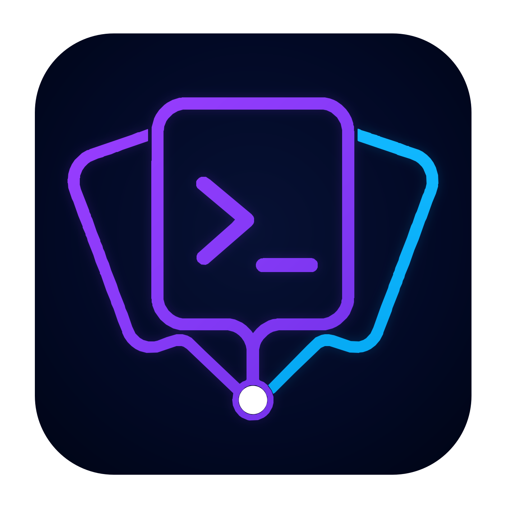
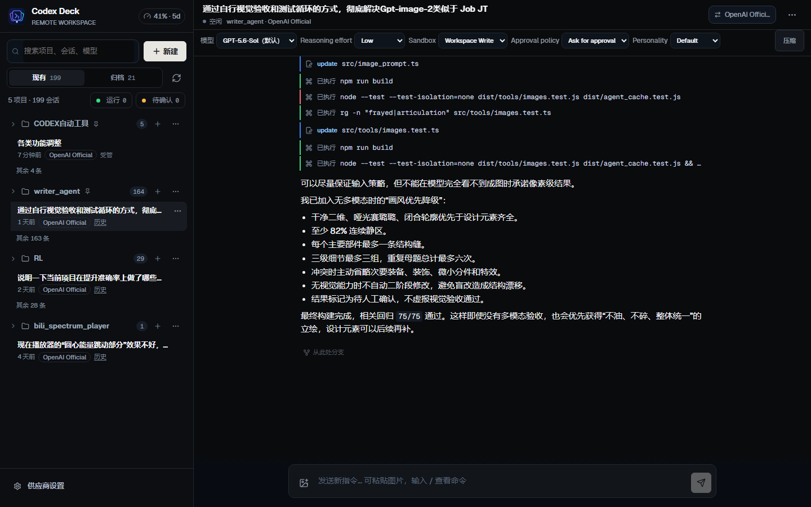
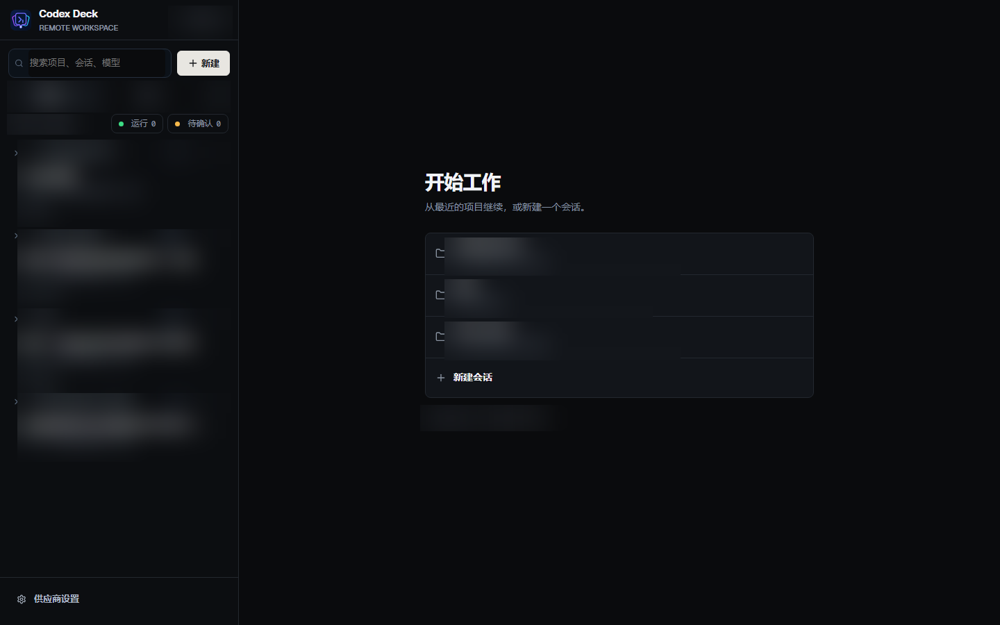
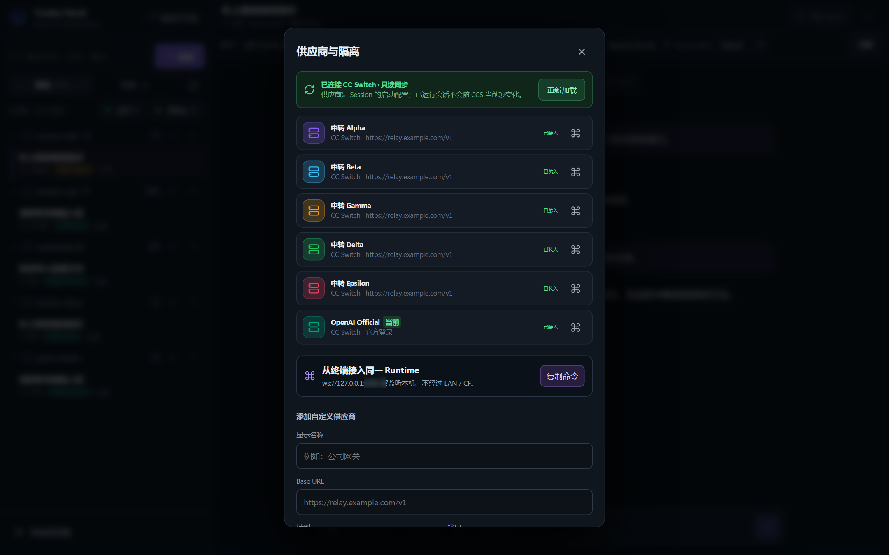
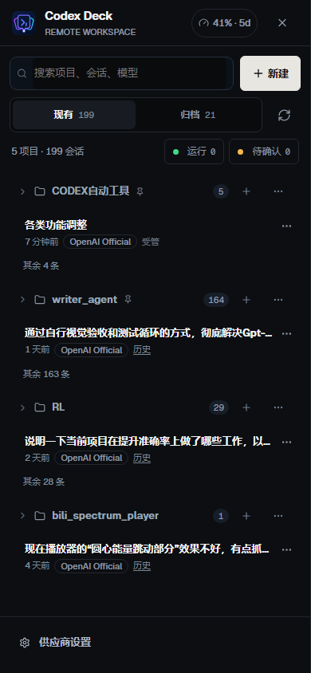

<div align="center">
  
  <h1>Codecks</h1>

[](https://nodejs.org/)
[](https://www.typescriptlang.org/)
[](https://react.dev/)
[](LICENSE)
</div>

[Codecks](https://github.com/Ovalene2333/Codecks) 是一个网页端的 [Codex CLI](https://github.com/openai/codex) 远程控制台，并提供 Claude Code adapter 后端。它帮你把 [CC Switch](https://github.com/farion1231/cc-switch) 里配好的多家中转站用起来：每个 Session 自己选供应商和模型，不必为了换一家、花另一份额度而去改 CC Switch 的当前项。

## 界面预览



<p align="center"><sub>桌面端会话界面：按项目分组，同时管理多个 Codex Session</sub></p>

<table>
  <tr>
    <td width="50%" align="center"><strong>项目控制台</strong></td>
    <td width="50%" align="center"><strong>供应商与模型</strong></td>
  </tr>
  <tr>
    <td></td>
    <td></td>
  </tr>
</table>

<p align="center">
  <strong>移动端远程值守</strong><br><br>
  
</p>

CC Switch 本身切供应商很快，但 Codex 一次只有一份 live 配置、一个「当前供应商」。想同时跑多家、把不同中转站的额度用完，靠来回切换当前项不够。Codecks 只读同步 CC Switch 里的连接定义，让多个 Session 可以同时走不同中转站。适合本机、局域网，以及 Cloudflare / 自建反代 / 任意隧道命令。

**Codecks** 这个名字由 **Codex** 与 **deck** 组合而来：一边是 Codex CLI 的真实会话，一边是远程值守用的控制台。

> `app-server` 目前仍是 Codex CLI 的实验接口。请使用较新的 CLI，升级后重新构建并重启 Codecks。

## 特性

### 真实会话，而不是复制品

Codecks 直接使用当前系统的 `~/.codex`。启动时读取已有 session，不会为每个供应商复制 `CODEX_HOME`，也不会把历史拆成孤岛。

- 按工作目录分组，同一路径可以并行多个独立 session
- 见过的项目目录会记在 `.data/projects.json`，新开网页、Runtime 还没列出历史时侧栏也还在
- Windows `D:\...` 与 WSL `/mnt/d/...` 会归入同一项目
- 查看运行、空闲、待审批和异常；刚完成且尚未打开的 Session 会标为「有新回复」，并可从侧栏单独筛选
- 审批请求使用全局浮窗显示，不必先进入对应 Session；可以在浮窗中直接批准或拒绝，也可以跳转到请求来源
- 可在侧栏开启浏览器系统提醒：页面保持连接时，新的审批和任务完成会发送通知，点击通知会打开对应 Session；浏览器关闭后不会后台推送
- 消息发送后会立即显示；未发送的文字与图片草稿按 Session 分开保留，切换会话不会串内容
- 历史输入消息可带回输入框编辑，或从该消息之前创建分支并重试；任务运行中（含待审批）发送的新输入会像 Codex CLI 一样 steer 当前 turn，空闲时才开启新 turn
- 输入框支持 Codex 高频指令：`/model`、`/permissions`、`/skills`、`/status`、`/usage`、`/mention`、`/fast`、`/mcp`、`/compact`、`/review`、`/init`、`/diff`、`/plan`、`/goal`，以及 `!command` 无沙箱执行；完整语法与后续路线见 [Slash 指令文档](docs/slash-commands.md)
- 右上角“外观设置”支持跟随系统、浅色或深色主题；动画可跟随系统的减少动态效果偏好、强制开启或完全关闭，选择只保存在当前浏览器
- 用量面板会汇总 session 的累计 token，并按项目或 session 查看输入、缓存输入和输出明细；历史用量从 Codex rollout 回填并缓存到 `.data/codex-usage.json`，重启 Server 后仍可恢复；Official 账号额度保留在独立页签
- 项目设置可覆盖该目录默认供应商的请求重试、流重试和流空闲超时；写进共享 Runtime，有会话在跑时先记下，空闲后再应用

### 远程值守

runtime 的 control WebSocket 只监听本机回环地址。终端用 `codex --remote` 接入后，可以和网页同时查看、审批、继续同一批 Session。

- 一个共享 Codex runtime，每个新 Session 独立选择 `modelProvider + model`
- 「切换供应商」会 `thread/fork`：完整复制历史到新分支，原分支保留以便回退
- 普通 `codex` 创建的旧 Session 仍会出现在历史里，但不会伪装成实时受管状态

### 多家中转同时在线，把额度用完

CC Switch 负责把供应商写进 Codex 的 live 配置，一次只能启用一个当前项。Claude Code 往往能跟着切；Codex 通常要重启进程才认新配置。真正麻烦的不是「CC Switch 不会切」，而是不能让 Session A 走这家、Session B 走那家。

Codecks 把 CC Switch 里的连接只读同步进来，每个 Session 自己选中转站和模型。

- 不用为了换一家而改 CC Switch 当前项
- 多个中转站可以同时各跑各的 Session，额度分开花
- 自动发现 CC Switch 数据库，周期性只读同步，不改写当前项
- 供应商设置里可手动「重新加载」：立刻再读一次 CC Switch，并在任务空闲时重启共享 Runtime
- 网页仍保留手动供应商入口，给没有安装 CC Switch 的环境用
- Node 服务可跑在 Windows 或 WSL；Windows 上可用 `--wsl` 读取 WSL 的 `~/.codex` 并在 WSL 中启动 runtime

## 快速开始

需要 Node.js 22+ 和可用的 `codex` 命令。

```bash
git clone https://github.com/Ovalene2333/Codecks.git
cd Codecks
npm install
npm run build
npm start
```

浏览器打开 [http://127.0.0.1:4174](http://127.0.0.1:4174)。

开发模式（前端 `5173`，后端 `4174`）：

```bash
npm run dev
```

### Claude Code 后端适配

Codecks 会同时注册 Codex 与 Claude Code adapter。新建 Session 时选择 Agent；同一实例和同一项目可以并存两种 Agent，会话创建后类型固定，项目会记住最近一次选择作为下次默认值。侧栏用 Agent 标签区分混合会话，不需要在启动 Codecks 时锁定类型。

Claude adapter 使用官方 Agent SDK，优先发现 `PATH` 中安装的 Claude Code，读取原生 `~/.claude/projects` JSONL 会话，保留 Claude session ID，并支持新建、续聊、流式输出、工具审批、图片输入和取消任务。未发现系统安装时使用 SDK 随附的 CLI；在 WSL 中会跳过 `/mnt/<盘符>` 下不可直接运行的 Windows Claude shim。CC Switch 中 `app_type='claude'` 的配置档会被只读加载；`ANTHROPIC_AUTH_TOKEN` 等环境变量只注入服务端子进程，不会进入快照、事件或浏览器缓存。

网页会按 `agentId` 使用通用 API，并根据 adapter 能力矩阵隐藏或禁用不支持的操作。可用 API：

```text
GET  /api/agents/claude/profiles
POST /api/agents/claude/threads
GET  /api/agents/claude/threads/:threadId
POST /api/agents/claude/threads/:threadId/turns
POST /api/agents/claude/threads/:threadId/interrupt
POST /api/agents/claude/approvals/:approvalId
```

新建会话至少传入 `cwd`；`providerId` 可省略以使用 CC Switch 当前 Claude 配置或 Claude CLI 当前配置。Claude 的 fork、归档、review、独立 shell、MCP/Skills 列表和动态会话设置尚未开放，能力矩阵会将这些操作标为不可用。

## 远程访问

远程访问拆成三层，互不绑定：

| 层   | 做什么                             | 常用参数                                |
| ---- | ---------------------------------- | --------------------------------------- |
| 监听 | Codecks 听哪个网卡                 | `--lan`、`--host`、`--port`             |
| 暴露 | 要不要、以及怎么把本地端口接到外面 | `--expose`、`--public-origin`           |
| 鉴权 | 谁能打开控制台                     | `REMOTE_TOKEN`、`--token`、`--no-token` |

启动后会生成访问令牌，并把带令牌的入口打印到终端。也可用 `REMOTE_TOKEN` 或 `--token` 固定令牌。`--public-origin` 或任何 `--expose` 都会视为远程入口，即使只监听 `127.0.0.1` 也会发令牌。

也可直接调用构建产物，或使用对应 scripts：`npm run lan`、`npm run cf-tunnel`、`npm run share`。

```bash
node dist-server/index.js --lan
```

### 实例

**1. 同一 Wi-Fi 下用手机打开**

只监听局域网，不拉隧道。终端会打印本机 IPv4 入口。

```bash
npm start -- --lan
```

**2. 已经有 Caddy / nginx / 独立 cloudflared / 路由器反代**

Codecks 继续听本机，只负责把带令牌的 https 入口打出来。反代把 `https://codecks.example.com` 转到 `127.0.0.1:4174` 即可。

```bash
npm start -- --public-origin https://codecks.example.com
```

等价写法：

```bash
npm start -- --expose announce --public-origin https://codecks.example.com
```

**3. 临时公网地址（Cloudflare Quick Tunnel）**

适合偶尔远程看一眼。每次启动会拿到一个新的 `*.trycloudflare.com`。需要本机有 `cloudflared`。

```bash
npm start -- --cf-tunnel
npm start -- --expose cloudflare:quick
```

`cloudflared` 不在 `PATH` 时：

```bash
npm start -- --cf-tunnel --cloudflared /path/to/cloudflared
```

**4. 固定域名的 Cloudflare Named Tunnel**

长期挂着同一个域名。`--share` 需要 connector token 和主机名，二者都可写在 `.env` 或命令行。

```bash
# .env 里已有 CF_TUNNEL_TOKEN 和 CF_TUNNEL_HOSTNAME
npm start -- --share
npm start -- --expose cloudflare:share

# 或全部写在命令行
npm start -- --share --share-host codecks.example.com --tunnel-token <connector-token>
npm start -- --expose cloudflare:share --public-origin https://codecks.example.com --tunnel-token <connector-token>
```

本机已经 `cloudflared login`、按名称拉起已有 Tunnel 时：

```bash
npm start -- --named-tunnel codecks-home --public-origin https://codecks.example.com
npm start -- --expose cloudflare:named=codecks-home --public-origin https://codecks.example.com
```

**5. 用 ngrok / 其它隧道命令**

Codecks 不内置这些工具，只负责启动你指定的命令，并从输出里抓公网 `https://` 地址。`{port}` 换成 Codecks 端口，`{url}` 换成 `http://127.0.0.1:<port>`。

```bash
# ngrok：从 stdout 自动抓 https://*.ngrok-free.app
npm start -- --expose command --tunnel-bin ngrok --tunnel-args "http {port}"

# 输出格式不规则时，自己写提取正则
npm start -- --expose command --tunnel-bin ngrok --tunnel-args "http {port}" --tunnel-url-pattern "https://[a-z0-9-]+\\.ngrok-free\\.app"

# 域名已经固定（预留域名、自建 frp 等），不必再扫输出
npm start -- --expose command --tunnel-bin cloudflared --tunnel-args "tunnel --url {url}" --public-origin https://codecks.example.com
```

也可以全部放进 `.env`，然后直接 `npm start`：

```dotenv
CODEX_DECK_EXPOSE=command
CODEX_DECK_TUNNEL_BIN=ngrok
CODEX_DECK_TUNNEL_ARGS=http {port}
```

**6. 固定令牌，方便书签收藏**

```bash
HOST=0.0.0.0 REMOTE_TOKEN='replace-with-a-long-random-string' npm start
```

PowerShell：

```powershell
$env:HOST = "0.0.0.0"
$env:REMOTE_TOKEN = "replace-with-a-long-random-string"
npm start
```

### 兼容入口与注意

| 旧参数                         | 等同于                                    |
| ------------------------------ | ----------------------------------------- |
| `--cf-tunnel` / `--share-once` | `--expose cloudflare:quick`               |
| `--share`                      | `--expose cloudflare:share`               |
| `--named-tunnel <名称>`        | `--expose cloudflare:named=<名称>`        |
| `--public-origin <url>`        | `--expose announce --public-origin <url>` |

`--share` 必须同时有 `CF_TUNNEL_TOKEN` 和主机名（`CF_TUNNEL_HOSTNAME` / `--share-host` / `--public-origin`）。`--expose command` 默认抓输出里第一个非回环 `https://`；扫不到就加 `--tunnel-url-pattern` 或 `--public-origin`。

`--no-token` 可与 `--lan` / `--expose` / `--cf-tunnel` / `--named-tunnel` 组合，但不能与 `--token` 或 `REMOTE_TOKEN` 同时使用。它会让所有能访问入口的人直接拥有命令执行和文件修改能力，只应在可信网络或已有额外访问控制时使用。

首次从非本机打开页面时，输入相同的 `REMOTE_TOKEN`。公网长期暴露时，建议再加一层身份验证（例如 Cloudflare Access）。

## 日常工作流

1. 启动 Codecks
2. 在「供应商设置」里复制终端接入命令
3. 在一个或多个终端中运行：

```bash
codex --remote ws://127.0.0.1:<runtime-port>
```

页面也可按当前项目生成带 `-C` 的命令。TUI 和网页连接同一个 runtime，因此网页能看到实时运行、审批和错误，并继续发送指令。

当前 Codex 版本里，provider 是 thread 创建属性，不能对同一个 thread 热切换。

## 配置

复制 [`.env.example`](.env.example) 为 `.env` 后按需填写。不要提交 `.env`。

| 变量                            | 默认值         | 说明                                                                    |
| ------------------------------- | -------------- | ----------------------------------------------------------------------- |
| `HOST`                          | `127.0.0.1`    | HTTP 监听地址                                                           |
| `PORT`                          | `4174`         | HTTP 端口                                                               |
| `REMOTE_TOKEN`                  | _(空)_         | API / WebSocket Bearer 令牌；非本机监听时必填                           |
| `CODEX_BIN`                     | `codex`        | Codex CLI 路径                                                          |
| `CODEX_WSL_BIN`                 | `codex`        | Windows `--wsl` 模式下的 WSL 内 Codex CLI                               |
| `CODEX_WSL_SHELL`               | `bash`         | 加载 WSL Codex `PATH` 的登录 shell                                      |
| `CODEX_WSL_HOME`                | WSL `~/.codex` | Windows `--wsl` 模式下的 Codex home                                     |
| `CLAUDE_CONFIG_DIR`             | 自动发现       | Claude 配置与历史目录；WSL 可指向 `/mnt/c/Users/<用户>/.claude`         |
| `CLAUDE_BIN`                    | 自动发现       | Claude Code 原生可执行文件、启动脚本或 JavaScript 入口路径              |
| `DATA_DIR`                      | `.data`        | Codecks 偏好、项目与用量缓存、自定义供应商元数据                        |
| `CODEX_DECK_RUNTIME_PORT`       | _(自动)_       | 仅监听本机的 Codex control WebSocket 端口                               |
| `CC_SWITCH_DB`                  | _(自动发现)_   | CC Switch SQLite 数据库绝对路径                                         |
| `CODEX_DECK_EXPOSE`             | _(空)_         | 暴露供应商：`announce` / `cloudflare[:quick\|named\|share]` / `command` |
| `CODEX_DECK_PUBLIC_ORIGIN`      | _(空)_         | 已有反代或固定域名时的 https 入口；也可用 `PUBLIC_ORIGIN`               |
| `CODEX_DECK_TUNNEL_BIN`         | _(空)_         | `command` 供应商的可执行文件                                            |
| `CODEX_DECK_TUNNEL_ARGS`        | _(空)_         | `command` 参数模板，支持 `{port}`、`{url}`                              |
| `CODEX_DECK_TUNNEL_URL_PATTERN` | _(自动)_       | 从命令输出提取公网 URL 的正则                                           |
| `CODEX_DECK_CLOUDFLARED`        | _(PATH)_       | `cloudflared` 可执行文件                                                |
| `CODEX_DECK_TUNNEL_PROTOCOL`    | `http2`        | Cloudflare Quick Tunnel 传输协议                                        |
| `CF_TUNNEL_TOKEN`               | _(空)_         | Named Tunnel connector token（`--share`）                               |
| `CF_TUNNEL_HOSTNAME`            | _(空)_         | 固定公网域名（`--share`）                                               |

### CC Switch

默认数据库路径：

- Windows：`%USERPROFILE%\.cc-switch\cc-switch.db`
- Linux / macOS：`~/.cc-switch/cc-switch.db`
- WSL：扫描 `/mnt/c/Users/*/.cc-switch/cc-switch.db`

自定义位置设置 `CC_SWITCH_DB`。该路径必须存在才会连接；不会再回退到默认位置。Codecks 不修改 CC Switch 数据库；供应商的新增、编辑和当前项切换应在 CC Switch 中完成。在供应商设置中点「重新加载」会重新发现数据库、刷新供应商列表，并在没有运行中或待审批会话时重启 Runtime。若当时有任务在跑，列表会先更新，空闲后再点「应用」。

CC Switch 的「本地路由」如果指向 Windows 的 `127.0.0.1`，在 WSL 2 镜像网络下通常可直接访问；传统 NAT 可能需要改成 Windows 主机地址，或直接在 Windows 运行 Codecks。

## 安全

- API Key、OAuth 内容和生成的供应商配置不会通过 API 返回给浏览器
- Claude CC Switch 配置中的认证环境变量只存在于 adapter 启动的进程环境中
- `.data/` 可能含自定义供应商密钥，已加入 `.gitignore`
- runtime control WebSocket 只监听 `127.0.0.1`，不会随 `--lan` 或 Cloudflare Tunnel 暴露
- 网页具备执行命令和批准文件修改的能力；公网使用时请同时启用令牌与额外访问控制

详见 [SECURITY.md](SECURITY.md)。

## 开发

```bash
npm install
npm run dev
npm test
npm run build
```

Agent runtime 的目录边界、能力契约和新 adapter 接入步骤见
[Agent Adapter 开发约定](docs/agent-adapters.md)。

## 故障排除

### Windows 上 `spawn EINVAL` 或 `connect ECONNREFUSED`

重新执行 `npm run build`，彻底退出旧进程后再启动。npm 全局安装的 Codex 在 Windows 上同时带有无扩展名脚本和 `codex.cmd`；Codecks 会优先通过 `node` 启动官方入口（或直接启动 `codex.exe`），避免把供应商参数拼进 `cmd.exe`。

如果 Codex 不在 `PATH`，用 `CODEX_BIN` 指向实际可执行文件。

### 现有 Session 列表为空

Codecks 通过 `thread/list` 读取当前系统 `~/.codex`。修改代码后需要重新构建并彻底重启后端：

```bash
npm run build
npm start -- --lan
```

启动日志若显示 app-server 退出，先运行 `codex --version`，或用 `CODEX_BIN` 指向可用的 CLI。

### Windows 与 WSL

Windows 上默认只读取 Windows 用户的 `~/.codex`，并启动 Windows 原生 runtime。若要使用 WSL 的 Codex：

```powershell
npm start -- --wsl
```

该模式通过 `wsl.exe` 读取 WSL 用户的 `~/.codex`，启动前会尝试加载常见的 Node 版本管理脚本，再启动 `codex app-server`。终端会先打印 WSL 唤醒和 app-server 进度；发行版冷启动或久置后这一步可能要几秒，不是卡死。如果 `codex` 只解析到 `/mnt/...` 下的 Windows npm shim，Codecks 会拒绝启动。Windows 工作目录会转换为 `/mnt/<盘符>/...`。新建会话会默认把初始工作目录切成 WSL 路径，因此工作目录旁的「WSL」按钮默认亮起；再点一次可切回 `D:\...`，`/home/...` 这类只存在于 Linux 的目录不能切回 Windows。该按钮只在 `--wsl` 时出现。侧栏会把同一块盘上的 `D:\项目` 与 `/mnt/d/项目` 收成一个项目；Windows 与 WSL 各自的 `~/.codex` 仍然隔离，两边的 Session 不能在同一个 Codecks 实例里合并，也不能互相 resume。

- WSL 内命令不是 `codex`：设置 `CODEX_WSL_BIN`
- 非 bash：设置 `CODEX_WSL_SHELL`
- 非默认 Codex home：设置 WSL 路径格式的 `CODEX_WSL_HOME`

Windows 的 `CODEX_HOME` 不会被 WSL 模式复用。在 Linux 或 WSL 内启动 Codecks 时，`--wsl` 不改变行为。Windows 和 WSL 的 `.codex` 彼此隔离，单个 Codecks 实例只加载所选平台的 Session。

同一份 `.data` 只能跑一个 Codecks 实例。不要同时开两个 `--wsl`、`npm start` 或 `npm run dev` 后端，否则后启动的进程会占用网页端口，却连不上前一个进程里还在跑的会话。`--wsl` 和默认 Windows 模式也不要对着同一个浏览器缓存混用。若启动时提示端口或实例已被占用，先结束旧进程再开。

### 自定义供应商与 OpenAI Official

带 Base URL 的中转供应商只使用该记录自己的 API Key。OpenAI Official 使用原生 `~/.codex/auth.json` 中的 ChatGPT 登录状态。自定义供应商通过进程启动参数和独立环境变量注入，不会改写 `config.toml`。

CC Switch 切换供应商时可能改写原生 `auth.json`。若 Official 报 401，先在 CC Switch 中切回 Official 并重新登录，再回到 Codecks 点「重新加载」或「应用」。

中转供应商标了「无独立 Key」时，在 CC Switch 中补上 API Key，再在 Codecks 供应商设置中点「重新加载」或「应用」后开新 Session。已有旧 Session 不会自动改鉴权。

### 为什么显示「待应用」

连接定义只在 app-server 启动时加载。Codecks 检测到变化后不会自动杀掉正在工作的 Session，而是显示「待应用」。任务空闲后点「应用」或「重新加载」会安全重启共享 runtime；历史 Session 不受影响，已连接的终端需要重新连接。

## 许可证

本项目使用 [MIT](LICENSE) 协议开源。

## 更多

- [贡献指南](CONTRIBUTING.md)
- [行为准则](CODE_OF_CONDUCT.md)
- [安全说明](SECURITY.md)
