<div align="center">
  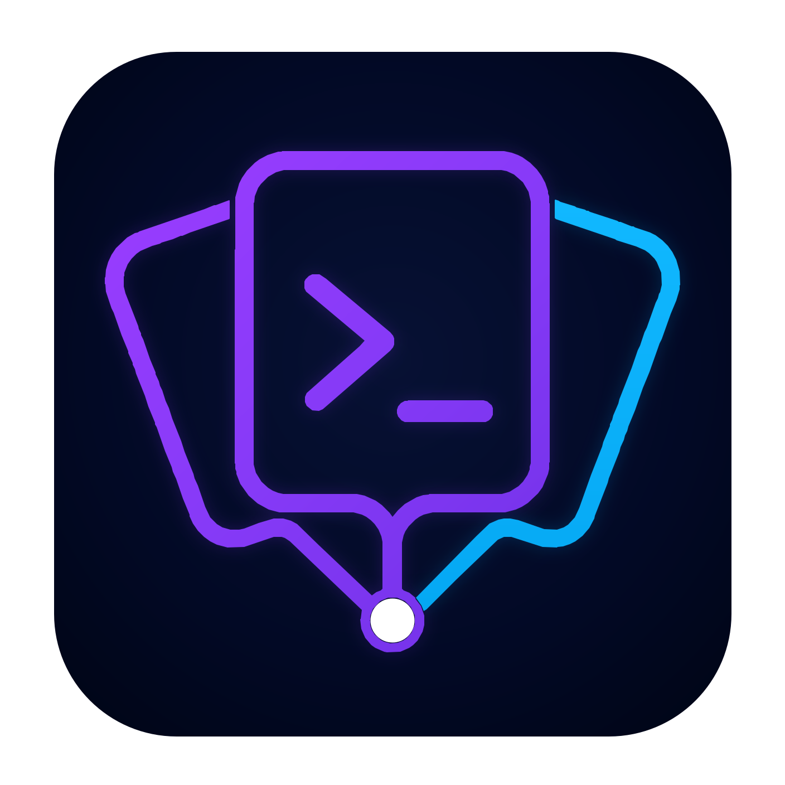
  <h1>Codecks</h1>

[](https://nodejs.org/)
[](https://www.typescriptlang.org/)
[](https://react.dev/)
[](LICENSE)
</div>

[Codecks](https://github.com/Ovalene2333/Codecks) 是一个跑在你自己电脑上的网页控制台，用浏览器（电脑或手机都行）盯着、指挥 AI 编程 Agent 干活。主要接 [Codex CLI](https://github.com/openai/codex)，也能接 Claude Code、OpenCode，以及通过 [ACP](https://agentclientprotocol.com) 接入的 Devin、Kimi CLI、Goose、Copilot CLI 等。

它直接用本机已有的登录状态、`~/.codex` 里的会话和你的项目目录，不另存一套历史。人不在电脑前，可以用手机看任务跑到哪了、批一下命令、接着往下聊。

只用 OpenAI Official 的话不需要装 CC Switch。如果你在 [CC Switch](https://github.com/farion1231/cc-switch) 里配了好几家中转，Codecks 可以让每个会话各选各的供应商和模型，不用来回切「当前项」。会话列表、任务和审批里都会标出实际用的是哪个 Agent。

## 阅读导引

- **先了解项目**
  - [界面预览](#界面预览)
  - [特性](#特性)
    - [总览首页](#总览首页) · [手机上用](#手机上用) · [真实会话](#真实会话) · [审批和提醒](#审批和提醒)
    - [对话和时间线](#对话和时间线) · [任务与用量](#任务与用量) · [工具](#工具) · [设置](#设置)
    - [远程值守](#远程值守) · [远程唤醒](#远程唤醒) · [多家中转同时在线](#多家中转同时在线)
- **开始使用**
  - [快速开始](#快速开始)
  - [Claude Code 后端适配（实验性）](#claude-code-后端适配)
    - 支持本机 Claude 登录态与 CC Switch 多配置档
  - [OpenCode 后端适配（实验性）](#opencode-后端适配)
  - [ACP 通用适配（实验性）](#acp-通用适配)
- **部署与日常使用**
  - [远程访问](#远程访问)
    - [访问实例](#实例)
    - [兼容入口与注意](#兼容入口与注意)
  - [日常工作流](#日常工作流)
- **配置与安全**
  - [配置](#配置)
    - [CC Switch（可选）](#cc-switch)
  - [安全](#安全)
- **开发与支持**
  - [开发](#开发)
  - [故障排除](#故障排除)
    - [Windows 启动错误](#windows-上-spawn-einval-或-connect-econnrefused)
    - [现有 Session 列表为空](#现有-session-列表为空)
    - [Windows 与 WSL](#windows-与-wsl)
    - [自定义供应商与 OpenAI Official](#自定义供应商与-openai-official)
    - [为什么显示“待应用”](#为什么显示待应用)
  - [许可证](#许可证) · [更多资源](#更多)

## 界面预览

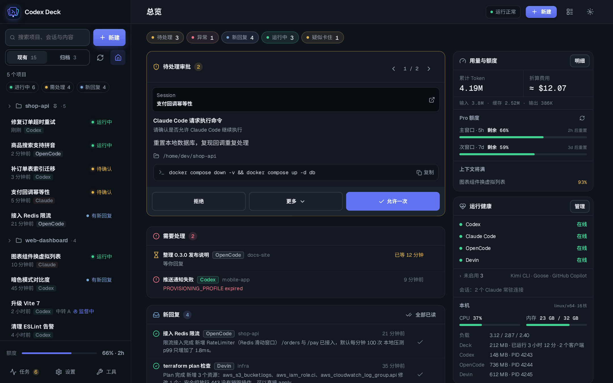

<p align="center"><sub>总览首页：待审批、要你处理的事、新回复、正在跑的任务；右边是用量额度和各 Agent 的运行状态</sub></p>

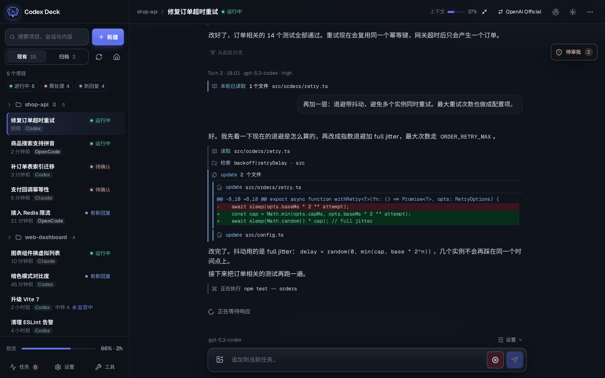

<p align="center"><sub>会话页：命令、读文件、改文件（点开能看 diff）都在时间线里，底下随时可以追加指令或中断</sub></p>

<table>
  <tr>
    <td width="50%" align="center"><strong>设置 · Agent</strong></td>
    <td width="50%" align="center"><strong>设置 · 供应商</strong></td>
  </tr>
  <tr>
    <td>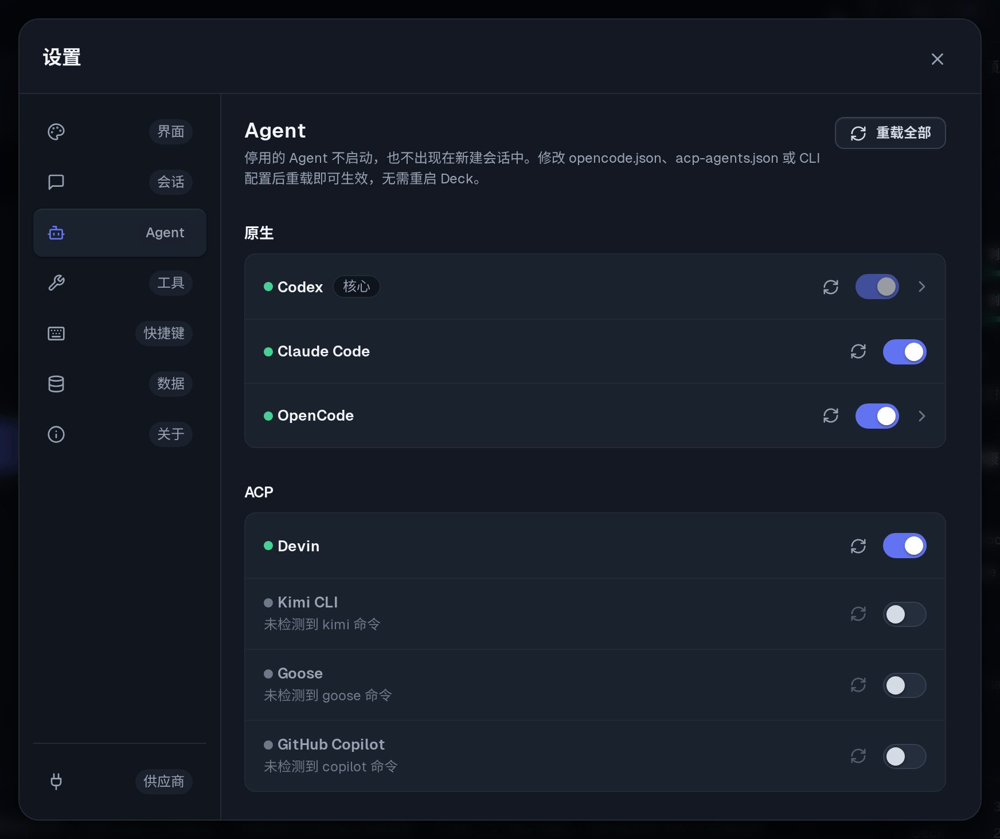</td>
    <td>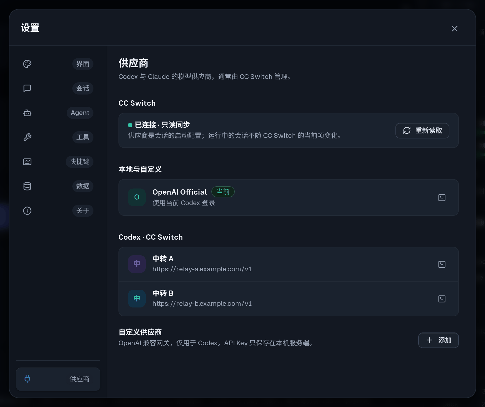</td>
  </tr>
</table>

<table>
  <tr>
    <td width="33%" align="center"><strong>手机 · 总览</strong></td>
    <td width="33%" align="center"><strong>手机 · 审批</strong></td>
    <td width="33%" align="center"><strong>手机 · 会话</strong></td>
  </tr>
  <tr>
    <td>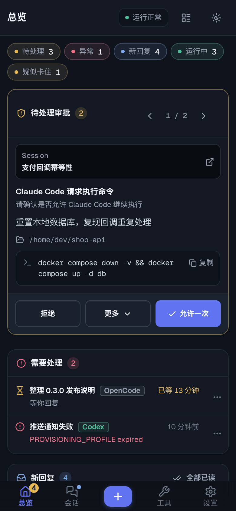</td>
    <td>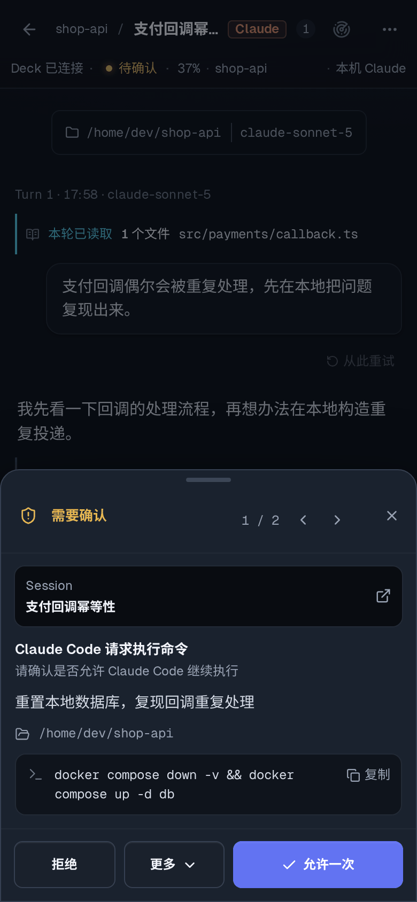</td>
    <td>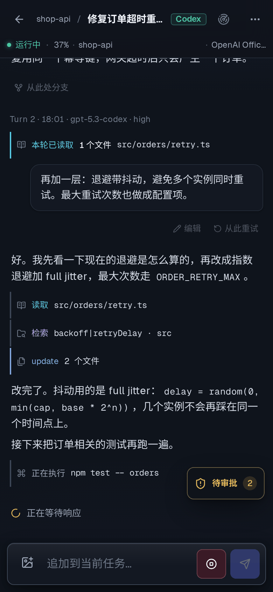</td>
  </tr>
</table>

<details>
<summary>浅色主题</summary>
<br>
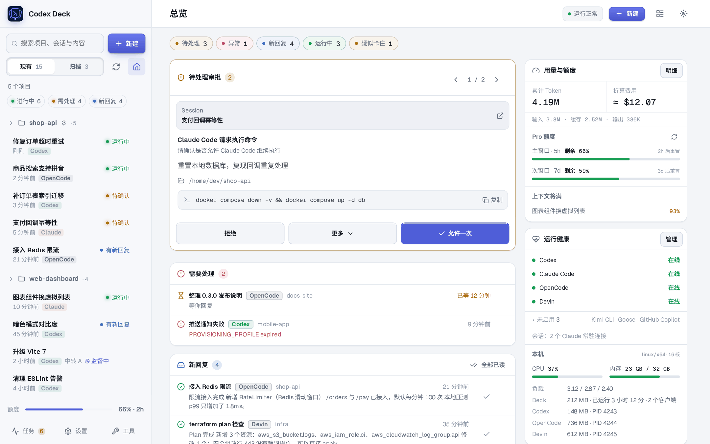
<br><br>
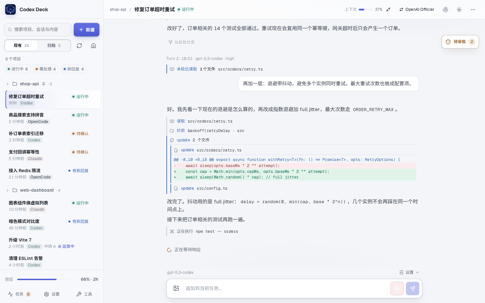
</details>

<p align="center"><sub>截图里的项目、会话和供应商都是演示数据。</sub></p>

Codecks 不依赖 CC Switch 或中转服务，有 OpenAI Official 登录就能直接用。要用多家连接的话，它会只读同步 CC Switch 里的连接定义，让多个会话同时走不同的供应商。本机、局域网、Cloudflare、自建反代或者任意隧道命令，都可以用来访问它。

名字是 **Codex** 加 **deck** 拼出来的：一边是 Codex CLI 的真实会话，一边是用来远程盯着它们的控制台。

> Codex CLI 的 `app-server` 目前还是实验接口。请用比较新的 CLI，升级后重新构建并重启 Codecks。

## 特性

### 总览首页

打开 Codecks 先看到的是总览（网址 `/`），按「现在该谁动手」分成几块：

- **待处理审批**：卡片直接批准或拒绝，多个审批可以左右切换
- **需要处理**：Agent 在等你回复的会话，以及出错的会话
- **新回复**：跑完了、你还没点开的会话，带回复开头的预览，可以一键全部标为已读
- **运行中**：正在跑的会话，显示当前在干什么（执行哪条命令、编辑哪个文件）和这一轮已经跑了多久
- **最近会话**
- **deck-wake 监督中**：本机上正在盯远端任务的 watcher，见[远程唤醒](#远程唤醒)

顶上一排计数（待处理、异常、新回复、运行中、疑似卡住），点一下滚到对应的列表。「疑似卡住」指运行中但很久没有新事件：等模型超过 3 分钟，或者一条命令超过 10 分钟没动静。

右边是两块面板：

- **用量与额度**：累计 token、按模型单价折算的费用、Official 账号额度，以及上下文快满的会话
- **运行健康**：各 Agent 的状态（没装或被停用的折叠在一行里）、供应商报错、本机 CPU 和内存、Deck 自己和各 Agent 后端进程的内存占用

「调整布局」可以拖动面板顺序，主栏和右栏各排各的，只保存在当前设备上。一个会话都没有时显示欢迎页。

### 手机上用

窗口窄于 760px 就自动换成手机布局：

- 底部导航是 总览 / 会话 / ＋新建 / 工具 / 设置。总览图标上的角标是等你处理的数量（待确认加出错），会话图标上的小点表示有新回复。进了某个会话，底栏就让位给输入框
- 会话列表是单独的整屏页面（`/sessions`）
- 审批从底部弹出来，可以直接批准一次、拒绝，或者展开「更多」看其它选项
- 设置在手机上先出分类列表，点进去才是具体页面，系统返回键退一级

每个页面都有自己的网址（`/`、`/sessions`、`/session/<key>`、`/terminal` 这类），刷新、分享链接、系统返回键都能回到原来的位置。

### 真实会话

Codecks 直接读本机的 `~/.codex`，不复制 `CODEX_HOME`，也不会把历史拆成孤岛。

- 按工作目录分组，同一个目录可以并行开多个会话。Windows 的 `D:\...` 和 WSL 的 `/mnt/d/...` 算同一个项目
- 项目折叠后不会只剩一条：运行中、待确认、出错、压缩中的会话，以及 24 小时内更新过的会话都会留着，当前打开的和有新回复的也不会被收起来，剩下的折进「其余 N 条」，展开就是全部
- 见过的项目目录记在 `.data/projects.json`，新开网页、或者 Runtime 还没列出历史的时候，侧栏也不会是空的
- 重启后先显示上次同步的会话摘要（`.data/thread-summaries.json`），再在后台跟原生历史对齐。摘要里没有完整对话，也不是另一份历史
- Codex 正常启动时走 app-server 的 State DB 索引列会话，不会再扫整个 rollout 目录。需要的话，在「设置 → Agent → Codex → 历史索引」点「修复」才会扫原生 rollout；State DB 丢了但本地还有缓存时，会自动修一次
- Claude 会话的 JSONL 大小、修改时间和摘要记在 `.data/claude-history-index.json`，下次启动只解析新增或有变化的文件
- 能看到每个会话是运行中、空闲、待审批还是出错。刚跑完、你还没打开的会话会标「有新回复」，侧栏可以单独筛出来
- 侧栏搜索除了项目名、会话名、模型和摘要，也会搜 Codex 和 Claude 会话里的用户消息和助手正文。输入至少 3 个字才搜正文，结果带命中片段，点开会定位到对应的 Turn。正文索引存在 `.data/session-search.sqlite`：第一次启动会在没有任务运行的时候，按最近会话优先、单并发慢慢建，完整对话不会塞进浏览器快照

### 审批和提醒

- 审批请求用全局浮窗显示，不用先进到对应的会话。可以在浮窗里直接批准或拒绝，也能跳到请求来源。总览首页上同样有审批卡片
- 权限选项跟 Codex CLI 对齐。新的 Codex 会话默认用 `Workspace Write + Approve for me`；旧版本留下的、没标 reviewer 的 `Workspace Write + Never ask` 项目默认值，会按这个更安全的默认值来理解。`Approve for me` 对应 `approval_policy = "on-request"` 加 `approvals_reviewer = "auto_review"`，越界请求交给 `codex-auto-review`；只有 `Never ask` 才是 `approval_policy = "never"`。自动审查要靠沙箱兜底，所以选 `Approve for me` 会用 `Workspace Write`，选 `Full Access` 会切到 `Never ask`
- 浏览器系统提醒在「设置 → 会话 → 系统提醒」里开：有新审批、有新回复时发通知，也可以设成只在页面不在前台时才发。点通知会打开对应的会话。页面得保持连接，浏览器关了就不会再推送

### 对话和时间线

- 消息发出去马上就显示。没发的文字和图片草稿按会话分开存，切换会话不会串
- 任务运行中（包括等审批）发的新消息，会像 Codex CLI 一样 steer 当前 Turn；空闲时才开新 Turn
- 历史里的用户消息可以带回输入框修改，也可以从那条消息之前开分支重试
- 输入框支持 Codex 的常用指令：`/model`、`/permissions`、`/skills`、`/status`、`/ps`、`/usage`、`/mention`、`/fast`、`/mcp`、`/compact`、`/review`、`/init`、`/diff`、`/plan`、`/goal`，还有 `!command` 无沙箱执行。完整语法和后续计划见 [Slash 指令文档](docs/slash-commands.md)
- 助手回复里的 Markdown 图片，以及 Codex 或兼容 Agent 生成的图片，先显示成「点击加载」，点了才请求，并且懒加载。用手机流量时能省不少
- 每个 Turn 会汇总本轮读过的文件。命令、文件改动、MCP 和动态工具调用跟着实时事件马上出现，不用等历史落盘
- 一次改了多个文件的 `update`，或者连续几次 `update`，会合并成一个可展开的文件改动组。读取和检索显示成可展开的中文动作，点开能看命令、参数和返回内容
- OpenCode 连续的文件编辑收成一行「编辑 N 次 · 文件名」，`Edit applied successfully.` 这种没信息量的回执默认藏起来，点开只看有实际内容的输出

### 任务与用量

- 侧栏的「任务」汇总所有受管的 Codex / Claude 会话：活动中的 Turn、在跑的命令、待确认状态，可以跳到来源，也能停掉整个任务。较新的 Codex Runtime 还会显示后台终端的 PID、CPU 和内存，可以单独停；旧 Runtime 自动退化成 Turn 级中断
- 用量面板汇总各会话累计的 token，可以按项目或会话看未缓存输入、缓存输入和输出；Official 账号额度单独一个页签。运行时用量缓存在 `.data/codex-usage.json`，重启 Server 后还在；「修复」历史索引时也会从 rollout 里回填缺的记录
- 项目设置可以覆盖该目录默认供应商的请求重试、流重试和流空闲超时。这些会写进共享 Runtime：有会话在跑就先记着，空闲后再生效
- 「设置 → Agent → Codex → 上下文」可以分别设 `model_context_window` 和 `model_auto_compact_token_limit`，留空就用模型或 Runtime 的默认值。设置存在 `.data/runtime-config.json`，不会改 `~/.codex/config.toml`。保存会重启共享的 Codex Runtime，有任务在跑或在等审批时会拒绝保存
- Codex Runtime 进程被外部结束（比如在后台按了 Ctrl+C）时，在跑或在等审批的会话会标成「运行时中断」并解除占用，可以继续分支、重试或改配置。刷新页面不会把它们又当成「正在运行」

### 工具

侧栏（手机上是底栏）的「工具」里放了几个小工具。每个工具是 `plugin/<id>/` 下的一个独立模块，前端视图和服务端能力分别注册。「设置 → 工具」里可以隐藏用不上的，也能选桌面端是在新标签页还是当前页打开。

- **Web Terminal**（`/terminal`）：打开后不会自动连接，选好当前会话、最近项目或者自己填一个绝对目录，再点连接才会在宿主机上起 Shell。支持 ANSI、全屏 TUI、窗口大小同步和手机快捷键。Windows 的 `--wsl` 模式进 WSL，其它情况进系统默认 Shell。关掉页面或断开连接，对应的 PTY 会自动结束
- **Git 管理**（`/git`）：选项目目录，看工作区和暂存区的改动，批量暂存或取消暂存，提交，切换或新建分支，fetch、快进 pull、push。不是仓库的目录可以直接 init。文件名和分支名都作为独立的 Git 参数传，不拼 Shell 命令
- **文本编辑器**（`/text-editor`，旧的 `/text-files` 会自动跳转）：逐级浏览宿主机目录（含隐藏文件和 WSL 路径），可以筛选、新建、重命名、删除，打开文本文件后在线编辑、查找、保存。超过 1MB 的文件只读预览开头一段；保存带 mtime 冲突检测，文件被外部改过的话要确认后才能覆盖
- **快捷指令**（`/commands`）：把常用命令存下来，点一下就在指定目录里执行。命令里可以写 `{参数名}` 占位符，执行前填值，值会做 Shell 转义。可以绑定目录，按目录分组。输出和退出码直接显示，超时 10 分钟，输出太长会截断。存在 `.data/quick-commands.json`

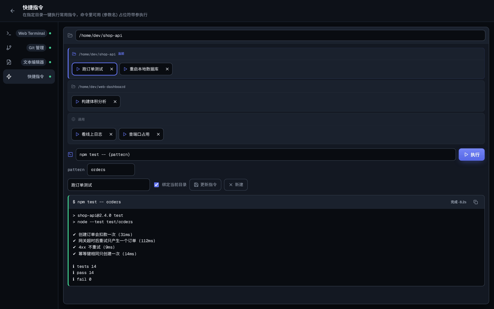

### 设置

桌面端点侧栏底部的「设置」，手机上点底栏的「设置」。

| 页面 | 里面有什么 |
| --- | --- |
| 界面 | 主题（跟随系统 / 浅色 / 深色）、动画、界面效果、会话正文字号，只存在当前浏览器 |
| 会话 | 发送键（Enter 发送，或 Ctrl/⌘+Enter 发送）、系统提醒、新会话的默认值 |
| Agent | 启用、停用、重载每个 Agent，不用重启 Deck；Codex 和 OpenCode 有各自的详情页 |
| 工具 | 工具菜单显示哪些、桌面端怎么打开 |
| 快捷键 | 桌面端快捷键一览 |
| 数据 | 设置备份（导出 / 导入 JSON，不含令牌和 API Key）、本地缓存、最近目录、恢复默认、在本设备退出 |
| 关于 | 版本、运行状态，一键复制诊断信息（只含版本、状态和错误首行，不含令牌、API Key 和会话内容） |
| 供应商 | 同步 CC Switch、添加自定义供应商。放在最下面，平时用得少 |

桌面端的快捷键：`Esc` 一层层往外退（先关最上面的弹窗，再让输入框失焦，最后回总览，终端里的 `Esc` 留给 Shell）；`/` 或 `Ctrl/⌘+K` 聚焦侧栏搜索；总览里有多个审批时用 `←` `→` 切换；文本编辑器里 `Ctrl/⌘+S` 保存、`Ctrl/⌘+F` 查找。

### 远程值守

runtime 的 control WebSocket 只监听本机回环地址。终端里用 `codex --remote` 接进来，就能和网页同时查看、审批、继续同一批 Session。

- 一个共享的 Codex runtime，每个新 Session 单独选 `modelProvider + model`
- 「切换供应商」会 `thread/fork`：把历史完整复制到新分支，原分支留着，想回退随时可以
- 用普通 `codex` 创建的旧 Session 还是会出现在历史里，但不会假装成实时受管的状态

### 远程唤醒

Agent 在远端（SSH、GPU 机器、Slurm 之类）启动了一个要跑几小时的任务，不用让它干等，你也不用自己反复去看。在本机挂一个后台 watcher，任务一结束，Deck 就往对应会话里注入一条 `[wake:<代号>] ...` 消息，Agent 从这里接着干。

- 会话头部的雷达图标打开「远程唤醒」：可以开启或关闭、自定义代号，能看到这个会话正被哪些 watcher 盯着，也能复制调用示例
- 总览首页的「deck-wake 监督中」列出本机上正在跑的 deck-wake watcher；watcher 没发出唤醒就消失了（被 kill、机器重启），会作为「失联」出现在「需要处理」里，由你决定要不要通知会话
- 唤醒请求 Deck 一收到就先落盘再返回 202，之后在后台重试到送达，所以 Agent 闪断、会话正忙或者 Deck 重启都不会丢。实在送不到的会出现在「需要处理」里
- 外部脚本也可以直接调接口，不必用 watcher：

```bash
curl -X POST "$(cat ~/.codex-deck/url)/api/wake/<代号>" \
  -H "Authorization: Bearer $(cat ~/.codex-deck/token)" \
  -H "Content-Type: application/json" -d '{"text":"任务已完成"}'
```

`~/.codex-deck/url` 和 `token` 是 Deck 启动时写下的，权限 600，方便本机脚本读取而不用把令牌贴进命令或会话；目录可以用 `CODEX_DECK_HOME` 改。

### 多家中转同时在线

CC Switch 会把供应商写进 Codex 的 live 配置，一次只能启用一个「当前项」。Claude Code 通常能跟着切，Codex 一般要重启进程才认新配置。麻烦的地方在于，没法让会话 A 走这家、会话 B 走那家。

Codecks 把 CC Switch 里的连接只读同步进来，每个会话自己选中转站和模型：

- 想换一家不用去改 CC Switch 的当前项
- 多个中转站可以同时各跑各的会话，额度分开花
- 自动发现 CC Switch 数据库，定期只读同步，不会改动当前项
- 「设置 → 供应商」里点「重新读取」，立刻再读一次 CC Switch，并在任务空闲时重启共享 Runtime
- 没装 CC Switch 的话，网页里也能手动添加自定义供应商
- Node 服务可以跑在 Windows 或 WSL；Windows 上用 `--wsl` 就会读 WSL 里的 `~/.codex`，并在 WSL 里启动 runtime

## 快速开始

需要 Node.js 22+ 和可用的 `codex` 命令。

日常使用的 Codex CLI 如果已经登录 OpenAI Official，启动 Codecks 后即可直接新建和继续 Session，不需要先配置供应商。

```bash
git clone https://github.com/Ovalene2333/Codecks.git
cd Codecks
npm install
npm run build
npm start
```

浏览器打开 [http://127.0.0.1:4174](http://127.0.0.1:4174)。

开发模式（前端 `5173`，后端 `4174`）：

```bash
npm run dev
```

### Claude Code 后端适配

> **实验性支持。** Claude Code adapter 尚未经过完整的环境与工作流测试，请先在非关键任务中验证。默认使用「本机 Claude」配置档——直接复用 `claude` CLI 的当前登录态（官方订阅 / `~/.claude` 凭据 / 环境变量）；也可以改用 CC Switch 中配置了自定义 `ANTHROPIC_BASE_URL` 和 relay 凭据的 Claude 中转服务。

Codecks 会同时注册 Codex 与 Claude Code adapter。新建 Session 时选择 Agent；同一实例和同一项目可以并存两种 Agent，会话创建后类型固定，项目会记住最近一次选择作为下次默认值。侧栏用 Agent 标签区分混合会话，不需要在启动 Codecks 时锁定类型。

Claude adapter 使用官方 Agent SDK，读取原生 `~/.claude/projects` JSONL 会话并保留 session ID。Deck 管理的会话会保持一条长期 SDK 连接，后续消息直接进入同一 Claude 进程；关闭浏览器不结束后台任务。会话头部显示 Deck 是否仍持有连接。永久删除已连接的空闲会话时，确认框会明确提示先关闭连接以及终止其中的后台任务；正在执行 turn 或被外部进程占用时不能删除，外部占用会显示 PID。支持流式输出、工具审批、图片输入、中断当前 turn、模型和权限调整、重命名、分支与删除。模型可选 Default、Sonnet、Opus、Haiku 或完整模型 ID。Windows 自动模式优先复用独立的 `claude.exe`，否则使用 SDK 随附 CLI；Windows `--wsl` 模式优先使用 WSL 中的 Claude。供应商可选「本机 Claude」（CLI 当前登录态）、CC Switch 中配置的中转、API key 或云端 provider。每个会话独立绑定供应商，凭据只注入对应子进程。会话连接保持期间不能热切换认证环境；如需换供应商，请创建分支并为分支选择新配置。外部 `claude attach` 会话仍由 Claude 自己的 supervisor 管理，Deck 不会要求运行 `claude stop` 或强行接管其进程。

网页会按 `agentId` 使用通用 API，并根据 adapter 能力矩阵隐藏或禁用不支持的操作。可用 API：

```text
GET  /api/agents/claude/profiles
GET  /api/agents/claude/models?providerId=<profileId>
POST /api/agents/claude/threads
GET  /api/agents/claude/threads/:threadId
PATCH /api/agents/claude/threads/:threadId
DELETE /api/agents/claude/threads/:threadId
POST /api/agents/claude/threads/:threadId/turns
POST /api/agents/claude/threads/:threadId/interrupt
POST /api/agents/claude/approvals/:approvalId
```

新建会话至少传入 `cwd`；`providerId` 可省略以使用当前配置档，`model` 和 `permissionMode` 可选。首次发送前可通过 `PATCH /api/agents/claude/threads/:threadId` 修改供应商；连接建立后，可调整模型与权限，但更换供应商需要新建或分支会话。Default 模型跟随 Claude Code 当前配置，界面另行显示实际运行的模型。没有独立凭据的 CC Switch Official 配置会显示为不可用；官方 OAuth 登录请选「本机 Claude」。Claude 支持从历史消息创建文件级分支和重试；`/skills` 面板可列出并引用可用 Skill（活跃连接经 SDK `reload_skills` 枚举，未连接时扫描 `.claude/skills` 目录）；归档、压缩、review、独立 shell 和 MCP 列表尚未开放。

### OpenCode 后端适配

OpenCode 会话摘要会持久化到 Deck 缓存，重启后可恢复；刷新时会按已知项目目录补拉会话，并保留 OpenCode 暂时返回的局部列表中未出现的历史会话。打开会话只会补充首条消息标题，不会因此刷新会话时间。

> **实验性支持。** 安装并登录 [OpenCode](https://opencode.ai/) CLI 后，Codecks 会在启动时运行独立的本机 `opencode serve`，并通过其本地 HTTP API 管理会话。默认从 `PATH` 查找 `opencode`；Windows 会通过 npm 安装生成的 `opencode.cmd` 启动，可通过 `OPENCODE_BIN` 指定其它可执行文件或脚本。冷启动最多等待 30 秒，失败时 Agent 状态会保留 OpenCode 的 stderr 摘要。OpenCode 未安装或启动失败不会阻止 Codex/Claude 使用，Agent 选择器会显示其离线状态；OpenCode 进程异常退出时只会让 Deck 内的 OpenCode 离线，不会按已退出的 PID 清理或影响电脑上其它 OpenCode 实例。

新建会话选择 OpenCode 后可使用其已配置的 provider 和模型，支持新建、续聊、流式文本与工具事件、图片输入、权限审批、取消、重命名、删除和模型调整。模型选择器与 OpenCode 自身一致：因为模型 ID 就是 `providerID/modelID`，选模型即选供应商，所有入口（新建会话、会话设置、命令面板）都只用一个按 provider 分组的可搜索选择器，不再先挑供应商再挑模型；关键字会同时匹配供应商名、模型名和模型 ID，「跟随 OpenCode 默认」表示不覆盖模型，由 OpenCode 配置决定，OpenCode 通过 `/config` 暴露的默认模型会在目录中标记「默认」。OpenCode 的 `/provider` 里已连接（connected）的供应商会排在目录最前面并在分组标题上标记「已连接」，未登录的供应商仍然可以浏览和搜索，只是排在后面。OpenCode 的供应商与模型目录可能长达数百项，这类长列表不再用原生下拉框呈现：打开后先输入关键字筛选，支持键盘上下键与回车确认，手机与桌面均可使用；在窄屏（≤760px）上该选择器会以底部弹出层的形式打开，可直接点选、滚动、点空白处或关闭按钮收起，不会被弹窗裁掉。每个模型同时返回图片输入能力（来自 OpenCode 的 `attachment` / `modalities` 元数据），对明确不支持视觉的模型，附加图片时输入框会出现提示，服务端也会在发送前直接拒绝并说明原因，不再等到任务报错才发现。会话历史直接从 OpenCode server 读取；`/skills` 面板经 `GET /skill` 列出项目与全局 Skill，选中后以 `/name` 命令调用。供应商切换、压缩、review、独立 shell 与 MCP 面板尚未开放，界面会根据能力矩阵隐藏或禁用对应操作。新建会话时选择的模型会写入会话设置并在刷新、重连和 Deck 重启后保留，不会被 OpenCode 的 `session.created` / `session.updated` 事件改回「跟随 OpenCode 默认」；只有 OpenCode 自身的标题、目录和时间戳会覆盖 Deck 的显示。会话命名与 Codex 对齐：OpenCode 原生的随机 `slug`（如 `curious-comet`）只在没有任何标题和消息时作为兜底展示，新建空会话显示「新 OpenCode 会话」，一旦有首条用户消息就用它（前 42 字）做标题；新建时填写的名称或手动重命名会写入 OpenCode 的 `title` 并始终优先，不会被首条消息覆盖。归档/恢复是 Deck 侧软归档：OpenCode serve 没有原生归档接口，归档后会话移入归档箱、服务端会话原样保留，归档态持久化后重启不丢失；运行中的会话不能归档，归档会话需要恢复后才能继续发送。分支（fork）走 OpenCode 原生 `POST /session/:id/fork`：每轮下的「从此处分支」完整复制历史到新分支，原分支保留；消息旁的「从此重试」先把原文带回输入框，改完再发送才真正分支重发（直接发送即用原文重试），首轮重试则新建空分支，不改动原会话历史与文件。fork 出来的分支带「分支」后缀与来源 chip，侧栏同样标记；fork 用的全是 OpenCode 官方接口，不动服务端原有会话存储结构。会话元信息与 `/status` 显示 OpenCode 实际使用的模型 ID：即使设置是「跟随 OpenCode 默认」，也会解析成最后一条回复里的 `providerID/modelID`，头部供应商名同样按这个解析结果走。上下文用量来自最后一条 assistant 回复的 tokens（input + output + reasoning + cache），上限取模型目录里的 `limit.context`，填进 `tokenUsage` 后头部上下文条、`/status` 与用量统计都会生效；该数值在打开会话或重新读取历史时刷新，不会在每一轮结束后实时回读。Agent 在任务中派生的 subagent 子会话（带 `parentID`）不再出现在会话列表中，其工作以父会话里的「子代理」卡片呈现：task 工具调用显示为专属卡片，运行中会在卡片下方实时滚动显示子代理的最新活动（当前执行的工具或回复文本尾部），结束后展开卡片可查看子代理的最终结果；子代理的过程性输出不会作为独立会话污染会话列表。输入框支持 OpenCode 原生 `/` 命令：`/compact`（别名 `/summarize`）压缩上下文，`/undo`、`/redo` 撤回/恢复最近一轮（含文件恢复，均需二次确认，也可在时间线每条用户消息旁按条撤回），`/init` 与 `.opencode/commands/*.md` 自定义命令透传执行，`/models` 打开模型选择器，`/new`、`/sessions` 指引到 Deck 的新建与列表切换，`/details`、`/thinking` 对应时间线里的可展开细节，完整行为见 [Slash 指令文档](docs/slash-commands.md)；`/share` 等分享类命令尚未接入，仍请用原生 TUI 执行。

### ACP 通用适配

> **实验性支持。** ACP（[Agent Client Protocol](https://agentclientprotocol.com)）是 CLI agent 的标准 JSON-RPC 协议，Devin、Kimi CLI、Goose、GitHub Copilot CLI、Factory Droid 等均已支持。Codecks 内置一个通用 ACP adapter：任何支持 ACP 的 CLI 只需一份启动描述符即可接入，不再需要为每家 CLI 编写专有 adapter。

安装对应 CLI 并登录后，新建 Session 时即可在 Agent 列表中选择（CLI 未安装时显示为离线，不影响其它 Agent）。Agent 选择器按启动协议分成「原生」与「ACP」两组标签页：Codex、Claude、OpenCode 等私有协议 adapter 归「原生」，所有经 ACP 接入的 CLI 归「ACP」。内置描述符覆盖 `devin`（`devin acp`）、`kimi`、`goose`、`copilot`、`droid` 等；接入其它 ACP CLI 或覆盖内置参数时，在 `DATA_DIR/acp-agents.json` 里声明（启动时会生成 `acp-agents.example.json` 样例）：

```jsonc
{
  "agents": [
    {
      "id": "my-agent",        // 小写字母/数字/中划线
      "name": "My Agent",
      "command": "my-agent",
      "args": ["acp"],
      "env": { "MY_API_KEY": "…" }
    }
  ]
}
```

内置的 ACP Agent 只有在 `PATH` 里找得到对应命令时才默认加载。每个 Agent 都能在「设置 → Agent」里单独启用、停用或重载，不用重启 Deck；改了 `acp-agents.json` 以后点「重载全部」，会按文件增删改 ACP Agent，有会话在运行的 Agent 会跳过。

ACP 会话支持新建、续聊、流式输出、工具与文件改动展示、权限审批、取消、重命名（Deck 侧）、软归档和 `plan` 计划面板；Agent 通过 `session/set_mode` 暴露的模式（如 Devin 的 normal/plan）可在顶部栏切换，模型目录与斜杠命令按 Agent 实际通告的能力展示。历史会话优先走 `session/list` + `session/load` 回放；不支持时可用描述符声明外部列举命令（如 `devin list --format json`），或直接保留重启前的缓存摘要。供应商切换、fork、压缩、review、独立 shell、MCP/Skills 等深度能力不在 ACP 协议范围内，界面按能力矩阵自动隐藏。

如果某个 ACP agent 与原生 adapter 共用同一份会话存储（典型例子是官方的 `claude-code-acp`，它和原生 Claude 一样读写 `~/.claude`），同一批会话会在列表里重复出现。在它的描述符里加 `"fallbackFor": "claude"`，把它声明为原生 Claude 的**备选**：原生 Claude 可用时，备选 agent 只在被 Deck 接管或正在运行的会话上可见，其余历史会话（重复项、空壳）不再出现在列表、搜索和索引里；原生 Claude 离线或历史读取失败时，备选 agent 的会话自动完整显示。备选 agent 仍可在新建会话的「ACP」标签页里选择，名称带「（备选）」。

```jsonc
{ "agents": [{ "id": "claude-acp", "name": "Claude (ACP)", "command": "claude-code-acp", "fallbackFor": "claude" }] }
```

正被其它进程占用的会话（如 Devin 的 session lock，`session/list` 经 `_meta` 上报）在列表中标记「占用中」：可以打开查看缓存历史，但发送、删除等操作会被拒绝并提示占用方；另一方关闭后，下一次刷新自动解除标记，直接发送即可让 Deck 接管会话。

### Agent 专属内容展示

会话时间线由通用的消息/命令/文件改动渲染器和每个 Agent 自己的前端适配器组成：Codex 形状的条目走通用渲染，Agent 原生特有条目（`extension` 条目）则交给对应适配器渲染。目前两条管线已打通：

- **Claude**：`TodoWrite` 产生的任务清单以勾选面板显示（运行中实时出现，历史会话同样保留），未知选项折叠展示。
- **OpenCode**：todo 工具的任务清单同样显示为勾选面板；工具事件保留结构化的入参与元数据。Agent 在任务中调用 OpenCode 的 question 工具提问时（新版 `question.asked` 事件），Deck 会弹出问题卡展示原生选项供选择回答或拒绝；旧的 question 类 permission 审批也兼容（携带原生问题时按问题卡渲染）。
- **ACP Agent**：`plan` 更新以勾选面板显示；其余原生条目走通用兜底。

没有专属适配器的 `extension` 条目回落为可展开的原始 JSON 视图，不会静默丢失。

## 远程访问

远程访问拆成三层，互不绑定：

| 层   | 做什么                             | 常用参数                                |
| ---- | ---------------------------------- | --------------------------------------- |
| 监听 | Codecks 听哪个网卡                 | `--lan`、`--lan6`、`--host`、`--port`   |
| 暴露 | 要不要、以及怎么把本地端口接到外面 | `--expose`、`--public-origin`           |
| 鉴权 | 谁能打开控制台                     | 扫码 / 6 位验证码 / `REMOTE_TOKEN`、`--token`、`--no-token` |

远程模式下默认开启配对鉴权：终端会打印带令牌的入口、扫码直达的二维码，以及一个每 60 秒更新的 6 位验证码。手机扫终端二维码直接进入控制台；在登录页手动打开时，输入验证码即可配对。也可用 `REMOTE_TOKEN` 或 `--token` 固定令牌，此时验证码配对关闭，但二维码照常打印。`--public-origin` 或任何 `--expose` 都会视为远程入口，即使只监听 `127.0.0.1` 也会发令牌。

也可直接调用构建产物，或使用对应 scripts：`npm run lan`、`npm run lan6`、`npm run cf-tunnel`、`npm run share`。

```bash
node dist-server/server/index.js --lan
```

### 实例

**1. 同一 Wi-Fi 下用手机打开**

只监听局域网，不拉隧道。终端会打印本机入口、扫码二维码和 6 位验证码。

```bash
npm start -- --lan
```

纯 IPv6 局域网（或本机有公网 v6）用 `--lan6`：监听 `::`（双栈，IPv4 照样可用），终端打印中括号 IPv6 入口。

```bash
npm start -- --lan6
npm run lan6
```

**2. 已经有 Caddy / nginx / 独立 cloudflared / 路由器反代**

Codecks 继续听本机，只负责把带令牌的 https 入口打出来。反代把 `https://codecks.example.com` 转到 `127.0.0.1:4174` 即可。

```bash
npm start -- --public-origin https://codecks.example.com
```

等价写法：

```bash
npm start -- --expose announce --public-origin https://codecks.example.com
```

**3. 临时公网地址（Cloudflare Quick Tunnel）**

适合偶尔远程看一眼。每次启动会拿到一个新的 `*.trycloudflare.com`。需要本机有 `cloudflared`。

```bash
npm start -- --cf-tunnel
npm start -- --expose cloudflare:quick
```

`cloudflared` 不在 `PATH` 时：

```bash
npm start -- --cf-tunnel --cloudflared /path/to/cloudflared
```

**4. 固定域名的 Cloudflare Named Tunnel**

长期挂着同一个域名。`--share` 需要 connector token 和主机名，二者都可写在 `.env` 或命令行。

```bash
# .env 里已有 CF_TUNNEL_TOKEN 和 CF_TUNNEL_HOSTNAME
npm start -- --share
npm start -- --expose cloudflare:share

# 或全部写在命令行
npm start -- --share --share-host codecks.example.com --tunnel-token <connector-token>
npm start -- --expose cloudflare:share --public-origin https://codecks.example.com --tunnel-token <connector-token>
```

本机已经 `cloudflared login`、按名称拉起已有 Tunnel 时：

```bash
npm start -- --named-tunnel codecks-home --public-origin https://codecks.example.com
npm start -- --expose cloudflare:named=codecks-home --public-origin https://codecks.example.com
```

**5. 用 ngrok / 其它隧道命令**

Codecks 不内置这些工具，只负责启动你指定的命令，并从输出里抓公网 `https://` 地址。`{port}` 换成 Codecks 端口，`{url}` 换成 `http://127.0.0.1:<port>`。

```bash
# ngrok：从 stdout 自动抓 https://*.ngrok-free.app
npm start -- --expose command --tunnel-bin ngrok --tunnel-args "http {port}"

# 输出格式不规则时，自己写提取正则
npm start -- --expose command --tunnel-bin ngrok --tunnel-args "http {port}" --tunnel-url-pattern "https://[a-z0-9-]+\\.ngrok-free\\.app"

# 域名已经固定（预留域名、自建 frp 等），不必再扫输出
npm start -- --expose command --tunnel-bin cloudflared --tunnel-args "tunnel --url {url}" --public-origin https://codecks.example.com
```

也可以全部放进 `.env`，然后直接 `npm start`：

```dotenv
CODEX_DECK_EXPOSE=command
CODEX_DECK_TUNNEL_BIN=ngrok
CODEX_DECK_TUNNEL_ARGS=http {port}
```

**6. 家里动态 IPv6 + 动态域名（DDNS）**

家里宽带只有动态 IPv6（无公网 IPv4）时，用 DDNS 把域名指到本机 IPv6，实现外网直连，无需隧道中转，速度就是运营商直连。Codecks 会监听 `::`、定期把检测到的公网地址写回 DNS 记录，并打印 `http://域名:4174/` 入口和二维码。路由器上把该端口转发到本机即可。

```bash
# DuckDNS：先去 duckdns.org 注册子域并拿到 token
DDNS_HOST=mydeck.duckdns.org DDNS_TOKEN=<token> npm start -- --expose ddns:duckdns

# Cloudflare DNS：需 API token（DNS 编辑权限）和 Zone ID
DDNS_HOST=deck.example.com DDNS_TOKEN=<api-token> DDNS_ZONE=<zone-id> npm start -- --expose ddns:cloudflare
```

`DDNS_IPV6` 默认 `auto`（取本机全局 IPv6，也可填死一个地址），`DDNS_IPV4` 默认 `none`（家宽多半没有公网 IPv4；有的话设为 `auto` 自动探测），`DDNS_INTERVAL` 默认每 10 分钟同步一次。DDNS 是明文 http 直连；需要 https 时在前面加反代并改用 `--public-origin` 宣告。

**7. 低延迟组网（Tailscale / ZeroTier，适合校园网）**

校园网、公司内网这种“不给 v6、不放行入站”的环境，别跟防火墙死磕：两边装 Tailscale（个人免费）进同一个账号，PC 和手机之间就是一根 WireGuard 直连隧道，延迟一般就是校园网到运营商的直连水平。Codecks 照常用 `--lan` 启动，终端会把 Tailscale 分配的 `100.x.x.x` 入口和二维码一起打印出来，手机连着 Tailscale 扫码即进，6 位验证码照常用。打洞失败时会自动转中继，照样可用、延迟高一点。ZeroTier 同理（免费 25 节点）。

**8. 固定令牌，方便书签收藏**

```bash
HOST=0.0.0.0 REMOTE_TOKEN='replace-with-a-long-random-string' npm start
```

PowerShell：

```powershell
$env:HOST = "0.0.0.0"
$env:REMOTE_TOKEN = "replace-with-a-long-random-string"
npm start
```

### 兼容入口与注意

| 旧参数                         | 等同于                                    |
| ------------------------------ | ----------------------------------------- |
| `--cf-tunnel` / `--share-once` | `--expose cloudflare:quick`               |
| `--share`                      | `--expose cloudflare:share`               |
| `--named-tunnel <名称>`        | `--expose cloudflare:named=<名称>`        |
| `--public-origin <url>`        | `--expose announce --public-origin <url>` |

`--share` 必须同时有 `CF_TUNNEL_TOKEN` 和主机名（`CF_TUNNEL_HOSTNAME` / `--share-host` / `--public-origin`）。`--expose command` 默认抓输出里第一个非回环 `https://`；扫不到就加 `--tunnel-url-pattern` 或 `--public-origin`。

`--no-token` 可与 `--lan` / `--expose` / `--cf-tunnel` / `--named-tunnel` 组合，但不能与 `--token` 或 `REMOTE_TOKEN` 同时使用。它会让所有能访问入口的人直接拥有命令执行和文件修改能力，只应在可信网络或已有额外访问控制时使用。

首次从非本机打开页面时，输入相同的 `REMOTE_TOKEN`。公网长期暴露时，建议再加一层身份验证（例如 Cloudflare Access）。

## 日常工作流

1. 启动 Codecks
2. 在「设置 → Agent → Codex」里点「复制终端命令」
3. 在一个或多个终端中运行：

```bash
codex --remote ws://127.0.0.1:<runtime-port>
```

页面也可按当前项目生成带 `-C` 的命令。TUI 和网页连接同一个 runtime，因此网页能看到实时运行、审批和错误，并继续发送指令。

当前 Codex 版本里，provider 是 thread 创建属性，不能对同一个 thread 热切换。

## 配置

复制 [`.env.example`](.env.example) 为 `.env` 后按需填写。不要提交 `.env`。

| 变量                            | 默认值                     | 说明                                                                                   |
| ------------------------------- | -------------------------- | -------------------------------------------------------------------------------------- |
| `HOST`                          | `127.0.0.1`                | HTTP 监听地址（IPv6 填 `::`）                                                          |
| `PORT`                          | `4174`                     | HTTP 端口                                                                              |
| `REMOTE_TOKEN`                  | _(空)_                     | API / WebSocket Bearer 令牌；非本机监听时必填                                          |
| `CODEX_BIN`                     | `codex`                    | Codex CLI 路径                                                                         |
| `CODEX_WSL_BIN`                 | `codex`                    | Windows `--wsl` 模式下的 WSL 内 Codex CLI                                              |
| `CODEX_WSL_SHELL`               | `bash`                     | 加载 WSL Codex `PATH` 的登录 shell                                                     |
| `CODEX_WSL_HOME`                | WSL `~/.codex`             | Windows `--wsl` 模式下的 Codex home                                                    |
| `CLAUDE_CONFIG_DIR`             | 自动发现                   | Claude 配置与历史目录；WSL 可指向 `/mnt/c/Users/<用户>/.claude`                        |
| `CLAUDE_BIN`                    | 自动发现                   | Claude Code 原生可执行文件或 JavaScript 入口；Windows npm `.cmd` 会通过 `cmd.exe` 启动 |
| `OPENCODE_BIN`                  | `opencode`                 | OpenCode CLI 路径，用于启动本机 OpenCode server                                        |
| `CLAUDE_WSL_BIN`                | `claude`                   | Windows `--wsl` 模式下优先使用的 WSL 内 Claude Code 命令                               |
| `CLAUDE_WSL_SHELL`              | `CODEX_WSL_SHELL` / `bash` | 探测并启动 WSL Claude 时使用的 shell                                                   |
| `DATA_DIR`                      | `.data`                    | Codecks 的偏好、项目、用量缓存、Agent 开关、快捷指令、自定义供应商等数据               |
| `CODEX_DECK_HOME`               | `~/.codex-deck`            | 本机发现目录：Deck 把访问地址和令牌写在这里（权限 600），给本机的唤醒脚本读            |
| `CODEX_DECK_RUNTIME_PORT`       | _(自动)_                   | 仅监听本机的 Codex control WebSocket 端口                                              |
| `CC_SWITCH_DB`                  | _(自动发现)_               | CC Switch SQLite 数据库绝对路径                                                        |
| `CODEX_DECK_EXPOSE`             | _(空)_                     | 暴露供应商：`announce` / `cloudflare[:quick\|named\|share]` / `command` / `ddns:duckdns\|ddns:cloudflare` |
| `CODEX_DECK_PUBLIC_ORIGIN`      | _(空)_                     | 已有反代或固定域名时的 https 入口；也可用 `PUBLIC_ORIGIN`                              |
| `CODEX_DECK_TUNNEL_BIN`         | _(空)_                     | `command` 供应商的可执行文件                                                           |
| `CODEX_DECK_TUNNEL_ARGS`        | _(空)_                     | `command` 参数模板，支持 `{port}`、`{url}`                                             |
| `CODEX_DECK_TUNNEL_URL_PATTERN` | _(自动)_                   | 从命令输出提取公网 URL 的正则                                                          |
| `CODEX_DECK_CLOUDFLARED`        | _(PATH)_                   | `cloudflared` 可执行文件                                                               |
| `CODEX_DECK_TUNNEL_PROTOCOL`    | `http2`                    | Cloudflare Quick Tunnel 传输协议                                                       |
| `CF_TUNNEL_TOKEN`               | _(空)_                     | Named Tunnel connector token（`--share`）                                              |
| `CF_TUNNEL_HOSTNAME`            | _(空)_                     | 固定公网域名（`--share`）                                                              |
| `DDNS_HOST`                     | _(空)_                     | DDNS 域名（`--expose ddns:*` 必填）                                                    |
| `DDNS_TOKEN`                    | _(空)_                     | DDNS 令牌 / API token（必填）                                                          |
| `DDNS_ZONE`                     | _(空)_                     | Cloudflare Zone ID（`ddns:cloudflare` 必填）                                           |
| `DDNS_IPV4`                     | `none`                     | `auto` / `none` / 固定 IPv4                                                            |
| `DDNS_IPV6`                     | `auto`                     | `auto` / `none` / 固定 IPv6                                                            |
| `DDNS_INTERVAL`                 | `10`                       | DDNS 同步间隔（分钟）                                                                  |

### CC Switch

默认数据库路径：

- Windows：`%USERPROFILE%\.cc-switch\cc-switch.db`
- Linux / macOS：`~/.cc-switch/cc-switch.db`
- WSL：扫描 `/mnt/c/Users/*/.cc-switch/cc-switch.db`

自定义位置设置 `CC_SWITCH_DB`。该路径必须存在才会连接；不会再回退到默认位置。Codecks 不修改 CC Switch 数据库；供应商的新增、编辑和当前项切换应在 CC Switch 中完成。在「设置 → 供应商」里点「重新读取」，会重新发现数据库、刷新供应商列表，并在没有运行中或待审批会话时重启 Runtime。如果当时有任务在跑，列表会先更新，等空闲了再点「应用」。

CC Switch 的「本地路由」如果指向 Windows 的 `127.0.0.1`，在 WSL 2 镜像网络下通常可直接访问；传统 NAT 可能需要改成 Windows 主机地址，或直接在 Windows 运行 Codecks。

## 安全

- API Key、OAuth 内容和生成的供应商配置不会通过 API 返回给浏览器
- Claude CC Switch 配置中的认证环境变量只存在于 adapter 启动的进程环境中
- `.data/` 可能含自定义供应商密钥，已加入 `.gitignore`
- runtime control WebSocket 只监听 `127.0.0.1`，不会随 `--lan` 或 Cloudflare Tunnel 暴露
- Web Terminal 等同于以 Codecks Server 用户身份登录宿主机，终端 WebSocket 使用同一访问令牌鉴权；快捷指令同样会在宿主机上执行命令。对外暴露时不要使用 `--no-token`，并建议在反向代理或隧道层再加一道访问控制
- 网页具备执行命令和批准文件修改的能力；公网使用时请同时启用令牌与额外访问控制
- 启动时会把访问地址和令牌写到 `~/.codex-deck/`（权限 600，目录可用 `CODEX_DECK_HOME` 改），给本机的唤醒脚本读。没开令牌时 `token` 文件是空的

详见 [SECURITY.md](SECURITY.md)。

## 开发

```bash
npm install
npm run dev
npm test
npm run build
```

Agent runtime 的目录边界、能力契约和新 adapter 接入步骤见
[Agent Adapter 开发约定](docs/agent-adapters.md)。界面的尺寸、组件和主题约定见 [UI 基线](docs/ui-baseline.md)。

`settings-harness.html`、`monitor-harness.html` 这类 `*-harness.html` 是不接后端的预览页（自带假数据），`npm run dev` 起来后在 Vite 里直接打开就行，改界面时用来点按验证。

## 故障排除

### Windows 上 `spawn EINVAL` 或 `connect ECONNREFUSED`

重新执行 `npm run build`，彻底退出旧进程后再启动。npm 全局安装的 Codex 在 Windows 上同时带有无扩展名脚本和 `codex.cmd`；Codecks 会优先通过 `node` 启动官方入口（或直接启动 `codex.exe`），避免把供应商参数拼进 `cmd.exe`。

如果 Codex 不在 `PATH`，用 `CODEX_BIN` 指向实际可执行文件。

### 现有 Session 列表为空

Codecks 通过 `thread/list` 读取当前系统 `~/.codex`。修改代码后需要重新构建并彻底重启后端：

```bash
npm run build
npm start -- --lan
```

启动日志若显示 app-server 退出，先运行 `codex --version`，或用 `CODEX_BIN` 指向可用的 CLI。

### Windows 与 WSL

Windows 上默认只读取 Windows 用户的 `~/.codex`，并启动 Windows 原生 runtime。若要使用 WSL 的 Codex：

```powershell
npm start -- --wsl
```

该模式通过 `wsl.exe` 读取 WSL 用户的 `~/.codex`，启动前会尝试加载常见的 Node 版本管理脚本，再启动 `codex app-server`。终端会先打印 WSL 唤醒和 app-server 进度；发行版冷启动或久置后这一步可能要几秒，不是卡死。如果 `codex` 只解析到 `/mnt/...` 下的 Windows npm shim，Codecks 会拒绝启动。Windows 工作目录会转换为 `/mnt/<盘符>/...`。新建会话会默认把初始工作目录切成 WSL 路径，因此工作目录旁的「WSL」按钮默认亮起；再点一次可切回 `D:\...`，`/home/...` 这类只存在于 Linux 的目录不能切回 Windows。该按钮只在 `--wsl` 时出现。侧栏会把同一块盘上的 `D:\项目` 与 `/mnt/d/项目` 收成一个项目；Windows 与 WSL 各自的 `~/.codex` 仍然隔离，两边的 Session 不能在同一个 Codecks 实例里合并，也不能互相 resume。

- WSL 内命令不是 `codex`：设置 `CODEX_WSL_BIN`
- 非 bash：设置 `CODEX_WSL_SHELL`
- 非默认 Codex home：设置 WSL 路径格式的 `CODEX_WSL_HOME`

Windows 的 `CODEX_HOME` 不会被 WSL 模式复用。在 Linux 或 WSL 内启动 Codecks 时，`--wsl` 不改变行为。Windows 和 WSL 的 `.codex` 彼此隔离，单个 Codecks 实例只加载所选平台的 Session。

同一份 `.data` 只能跑一个 Codecks 实例。不要同时开两个 `--wsl`、`npm start` 或 `npm run dev` 后端，否则后启动的进程会占用网页端口，却连不上前一个进程里还在跑的会话。`--wsl` 和默认 Windows 模式也不要对着同一个浏览器缓存混用。若启动时提示端口或实例已被占用，先结束旧进程再开。

### 自定义供应商与 OpenAI Official

带 Base URL 的中转供应商只使用该记录自己的 API Key。OpenAI Official 使用原生 `~/.codex/auth.json` 中的 ChatGPT 登录状态。自定义供应商通过进程启动参数和独立环境变量注入，不会改写 `config.toml`。

CC Switch 切换供应商时可能改写原生 `auth.json`。若 Official 报 401，先在 CC Switch 中切回 Official 并重新登录，再回到 Codecks 的「设置 → 供应商」点「重新读取」或「应用」。

中转供应商标了「无独立 Key」时，在 CC Switch 中补上 API Key，再在 Codecks 的「设置 → 供应商」里点「重新读取」或「应用」，然后开新 Session。已有的旧 Session 不会自动改鉴权。

### 为什么显示「待应用」

连接定义只在 app-server 启动时加载。Codecks 检测到变化后不会自动杀掉正在工作的 Session，而是显示「待应用」。任务空闲后点「应用」或「重新读取」会安全重启共享 runtime；历史 Session 不受影响，已连接的终端需要重新连接。

## 许可证

本项目使用 [MIT](LICENSE) 协议开源。

## 更多

- [贡献指南](CONTRIBUTING.md)
- [行为准则](CODE_OF_CONDUCT.md)
- [安全说明](SECURITY.md)
